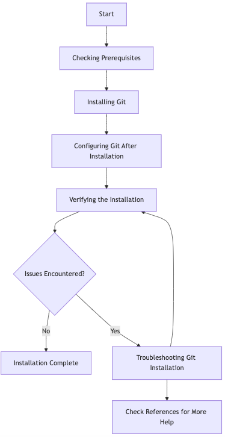

# About this guide

This guide helps you install Git on your Apple work computer.



# Prerequisites

Before the installation, ensure you have:

- Visual Studio Code preinstalled
- Remote SSH plugin for Visual Studio Code preinstalled

If any of the above is not installed on your system, contact your system administrator.

# Installing Git on macOS

The full installation of git requires the following steps.

## Installing git

1. Install git with the following command:
   ```console
   brew install git
   ```
1. Wait until the installation finishes. For troubleshooting tips, see Troubleshooting.





# Reviewing installation process



# References


